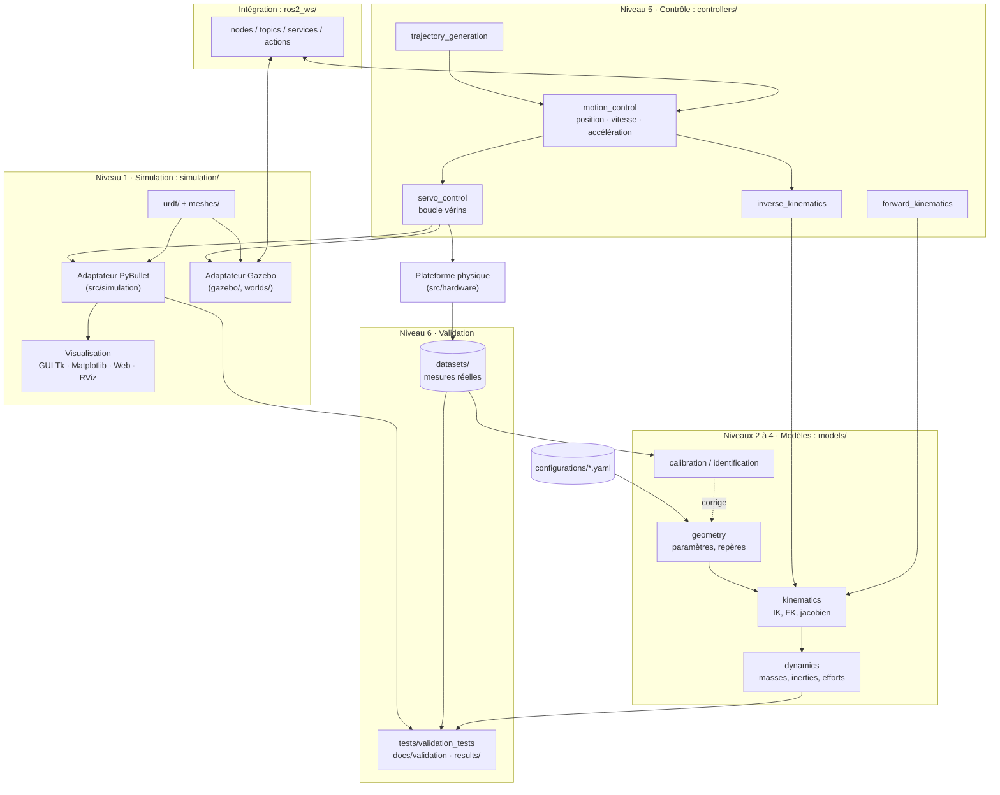
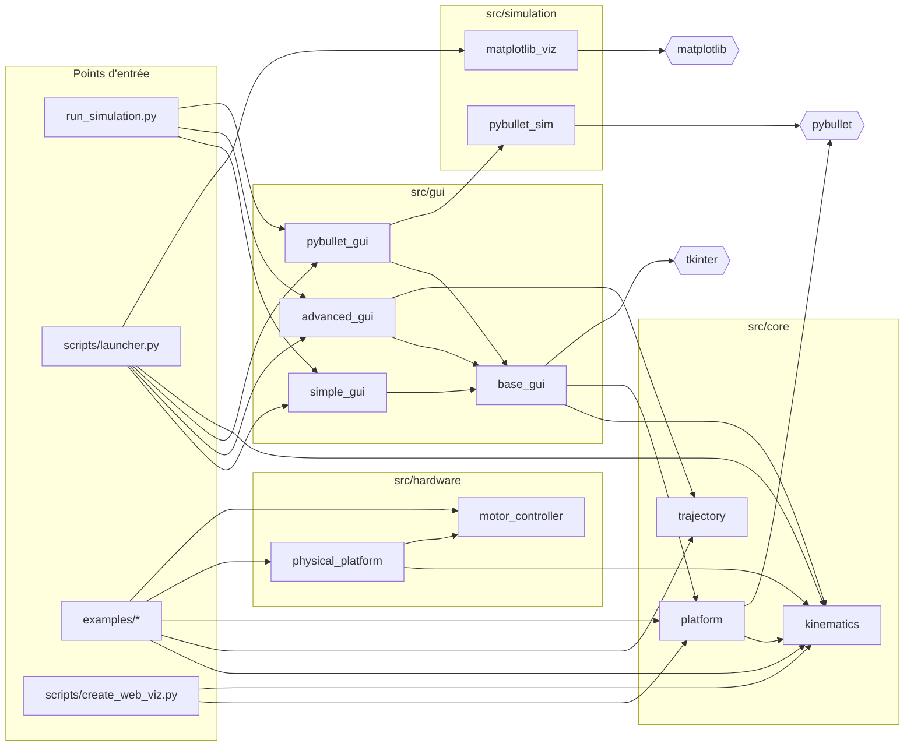
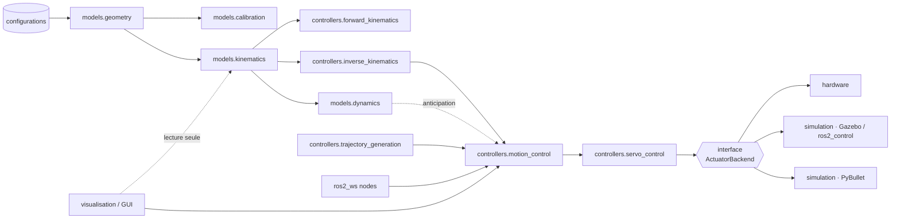

# Architecture : jumeau numérique de la plateforme Stewart (projet REM)

> Ce document décrit l'**architecture cible** et l'**état actuel** de chaque niveau.
> Diagnostic détaillé de départ : [`docs/reports/2026-09-24_analyse_depot.md`](docs/reports/2026-09-24_analyse_depot.md).
> Décision de transition : [`docs/decisions/ADR-0001-conserver-package-src.md`](docs/decisions/ADR-0001-conserver-package-src.md).

## Principes

1. **Le modèle ne dépend jamais du simulateur.** Géométrie, cinématique et dynamique sont du NumPy pur, testable sans PyBullet, Gazebo ni ROS2.
2. **Une seule source de vérité pour les paramètres**, dans `configurations/*.yaml`. Aucun paramètre géométrique en dur dans le code.
3. **Unités SI partout** (m, rad, kg, N, s) dans les API internes. Conversions (mm, degrés) uniquement aux frontières (GUI, matériel).
4. **Le simulateur est un adaptateur** : PyBullet aujourd'hui, Gazebo/ROS2 demain, derrière la même interface.
5. **Chaque résultat est traçable** : données dans `datasets/`, résultats dans `results/`, fiche d'expérimentation dans `docs/experiments/`.

## Vue d'ensemble

## Niveau 1 : Simulation

| Élément | Emplacement | État |
|---|---|---|
| Modèle URDF (51 liens, 50 joints) | `simulation/urdf/Stewart.urdf` | ✅ Existant (export Fusion 360) |
| Maillages STL (51) | `simulation/meshes/` | ✅ Existant |
| Graphe des liens | `simulation/urdf/Link_graph.txt` | ✅ Existant |
| CAO source | `models/geometry/cad/Stewart_CAD.f3d` | ✅ Existant |
| Adaptateur PyBullet | `src/core/platform.py::StewartPlatform` | ✅ Boucle fermée validée : **0,28 mm / 0,044°** avec gravité, 8 µm sans ([EXP-004](docs/experiments/EXP-004-simulation-boucle-fermee.md)) |
| Ancien adaptateur | `src/simulation/pybullet_sim.py::PyBulletSimulator` | ⚠️ Sans fermeture de boucle : à fusionner dans `StewartPlatform` |
| Identification géométrique | `src/simulation/urdf_geometry.py` | ✅ Centres des cardans extraits du URDF (EXP-001) |
| Gazebo, mondes, launch | `simulation/gazebo/`, `simulation/worlds/`, `simulation/launch/` | ⬜ À créer (Phase 4) |
| Visualisation | `src/gui/`, `src/simulation/matplotlib_viz.py`, `scripts/create_web_viz.py` | ✅ Existant, à découpler du modèle |

**Fermeture de boucle** : l'URDF est un arbre et chaque jambe une chaîne U-P-R-U à 6 degrés de liberté (cardans idéaux, EXP-001). Cinq jambes sont fermées à l'exécution par des contraintes `JOINT_FIXED` **ancrées sur la pose relative des liens en configuration zéro** (les repères de contrainte PyBullet sont relatifs au centre de masse), entre les paires `joint_indices = [(6,16), (35,17), (49,18), (42,19), (28,20)]`, et la 6e est fermée par l'arbre lui-même. Les vérins sont les joints prismatiques `Slider_13` à `Slider_18` = jambes 1 à 6, soit `DEFAULT_ACTUATOR_INDICES = [2, 31, 45, 38, 24, 9]` (`src/core/platform.py`), dans l'ordre des sorties de l'IK. Cette correspondance est validée à 0,4° près par [EXP-002](docs/experiments/EXP-002-validation-ik-urdf.md). L'ancien ordre `[9, 2, 31, 45, 38, 24]` n'était valable qu'avec l'IK historique. Sous Gazebo, cette fermeture devra passer par SDF (`<joint>` en boucle) ou par un plugin.

**Pièges du modèle URDF** (EXP-004) :

- la configuration zéro correspond aux **vérins en butée basse** (course [0 ; 0,19] m) : travailler autour de `DEFAULT_WORKING_HEIGHT = 0,09 m` (`move_to_working_position()`) ;
- 11 articulations passives ont des limites **[0 ; 2π]** (export Fusion 360) qui bloquent le mécanisme. `setup_constraints()` les recentre sur [−π ; π].

## Niveau 2 : Géométrie

| Élément | Valeur actuelle | Source |
|---|---|---|
| Rayon base `r_B` | 0,2 m (modèle) · **0,19958 m** (URDF) | `configurations/platform_config.yaml` (`platform`, `platform.identified`) |
| Rayon plateforme `r_P` | 0,2 m · **0,19958 m** | idem |
| Demi-angles `γ_B`, `γ_P` | 12° · **12,295°** (γ_P : 12,19 à 12,40°) | idem |
| Hauteur neutre | 0,257547 m (en dur dans `src/core/kinematics.py`) · **(−1,17 ; 0,42 ; 253,489) mm** | idem |
| Géométrie de référence | points d'attache identifiés (écart au modèle paramétrique : 0,8 à 1,6 mm) | `InverseKinematics.from_attachment_points`, `StewartPlatform.from_urdf` ([EXP-001](docs/experiments/EXP-001-geometrie-urdf.md)) |
| Points d'attache | `B_i = r_B [cos φ_Bi, sin φ_Bi, 0]ᵀ`, `φ_B = {7π/6 ± γ_B, π/2 ± γ_B, 11π/6 ± γ_B}` | `InverseKinematics.calculate_attachment_points` |

**Repères (à formaliser en Phase 1)** :

- `{W}` : monde (sol PyBullet/Gazebo), z vers le haut.
- `{B}` : base fixe, origine au centre du cercle des attaches, confondue avec `{W}` pour l'instant.
- `{P}` : plateforme mobile, origine au centre du cercle des attaches, à `home_pos` en position neutre.
- `{T}` : outil (interface d'attelage REM), **à définir** par rapport à `{P}`.
- Convention d'orientation effective : `R = Rx(roll) · Ry(pitch) · Rz(yaw)`, angles en degrés dans l'API actuelle (voir anomalie A6).

Cible : `models/geometry/` expose un objet `PlatformGeometry` immuable, construit depuis le YAML, et partagé par tous les modules.

## Niveau 3 : Cinématique

| Fonction | Emplacement | État |
|---|---|---|
| Cinématique inverse | `src/core/kinematics.py::InverseKinematics` | ✅ Implémentée et **validée contre le URDF** (EXP-002). L'IK d'origine décrivait le mécanisme tourné de −60°. Deux géométries : paramétrique (r, γ) ou points identifiés (`from_attachment_points`) |
| Cinématique directe (Newton-Raphson sur les 6 longueurs) | `models/kinematics/` | ⬜ À créer |
| Jacobien, singularités, conditionnement | `models/kinematics/` | ⬜ À créer |
| Espace de travail | `models/kinematics/` | ⬜ À créer |
| Dérivation théorique | `models/kinematics/notebooks/analysis.ipynb`, `docs/design/README_original.md` | ✅ Existant |

`L_i = t + h + R · P_i − B_i`, avec `ℓ_i = ‖L_i‖`.

## Niveau 4 : Dynamique

| Élément | État |
|---|---|
| Masses et inerties par lien | ✅ Dans le URDF (base 13,76 kg), non exploitées hors PyBullet |
| Modèle de masse et d'inertie de la plateforme + charge utile (timon de remorque) | ⬜ `models/dynamics/` |
| Gravité | PyBullet uniquement (`-9,81 m/s²`) |
| Efforts dans les vérins (statique : `f = J⁻ᵀ · w`, puis dynamique inverse Newton-Euler) | ⬜ `models/dynamics/` |
| Identification des paramètres | ⬜ `models/identification/` |

## Niveau 5 : Contrôle

| Élément | Emplacement actuel | Cible | État |
|---|---|---|---|
| Génération de trajectoires | `src/core/trajectory.py` | `controllers/trajectory_generation/` | ⚠️ Purement géométrique, sans loi horaire ; bug A7 |
| Contrôle en position | interpolation linéaire + `POSITION_CONTROL` PyBullet | `controllers/motion_control/` | ⚠️ Basique |
| Contrôle en vitesse / accélération | aucun | `controllers/motion_control/` | ⬜ |
| Asservissement des vérins | `src/hardware/motor_controller.py` (stub, P seul) | `controllers/servo_control/` | ⚠️ Stub |
| Contrôle inverse (pose → vérins) | `InverseKinematics` | `controllers/inverse_kinematics/` | ✅ |
| Contrôle direct (vérins → pose) | aucun | `controllers/forward_kinematics/` | ⬜ |

## Niveau 6 : Validation

| Élément | Emplacement | État |
|---|---|---|
| Mesures | `datasets/` | ⬜ Aucune donnée réelle |
| Tests unitaires | `tests/unit_tests/` | ✅ 16 tests (IK paramétrique et à points identifiés, plateforme physique) |
| Tests d'intégration | `tests/integration_tests/` | ⚠️ Scripts hérités ; 2 imports cassés, 1 nécessite un affichage |
| Tests de validation | `tests/validation_tests/` | 🟡 12 tests : IK contre URDF (EXP-002), géométrie (EXP-001), suivi en boucle fermée (EXP-004) ; simulation contre réel à venir |
| Analyse d'erreur | `results/`, `docs/validation/` | ⬜ |
| Traçabilité CIR | `docs/experiments/` | ✅ Gabarit + EXP-001, EXP-002, EXP-004 |

## Dépendances des modules

### État actuel (code dans `src/`)

Problème visible : `src/core/platform.py` (cœur) importe `pybullet`, et `base_gui` importe `platform`. Toute la chaîne GUI hérite donc de PyBullet, même la GUI « simple ».

### Cible

Règle : **les flèches ne remontent jamais**. `models` n'importe ni `controllers`, ni `simulation`, ni `ros2_ws`, ni la GUI.

## Architecture ROS2 envisagée (Phase 5)

| Node | Rôle | Interfaces |
|---|---|---|
| `stewart_ik_node` | Pose → longueurs | sub `/platform/pose_cmd` (`geometry_msgs/PoseStamped`), pub `/actuators/length_cmd` (`std_msgs/Float64MultiArray`) |
| `stewart_fk_node` | Longueurs → pose estimée | sub `/actuators/length_state`, pub `/platform/pose_est` |
| `trajectory_node` | Exécution de trajectoires | action `/platform/follow_trajectory` |
| `hitch_alignment_node` | Alignement attelage REM | service `/rem/align`, sub capteurs de vision |
| Simulation | Gazebo + `ros2_control` | `/joint_states`, contrôleurs de joints prismatiques |

Le package ROS2 importera `models` et `controllers` comme bibliothèques Python : **aucune logique métier dans les nodes**.

## Correspondance entre l'existant et la cible

| Existant | Cible | Phase |
|---|---|---|
| `src/core/kinematics.py` | `models/kinematics/` + `controllers/inverse_kinematics/` | 2 |
| `src/core/trajectory.py` | `controllers/trajectory_generation/` | 5 |
| `src/core/platform.py` | adaptateur `simulation/` (PyBullet) | 4 |
| `src/simulation/pybullet_sim.py` | fusion avec le précédent | 4 |
| `src/hardware/*` | `controllers/servo_control/` + backend matériel | 5 |
| `src/gui/*`, `matplotlib_viz` | couche visualisation | 4 |

Chaque déplacement laissera un **module de compatibilité** dans `src/` qui réexporte l'ancienne API (voir ADR-0001).
